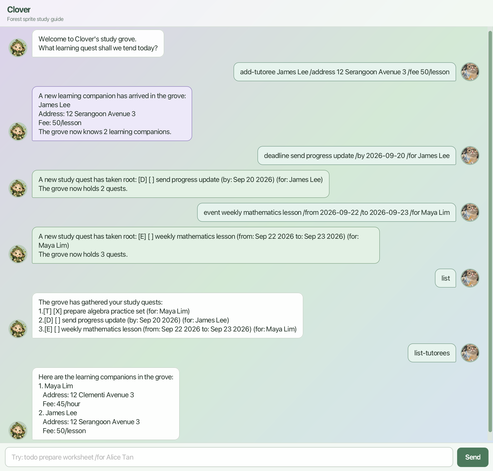

# Clover User Guide

Clover is a desktop application for private tutors who want one place to manage teaching tasks and their tutoree directory. It is optimized for keyboard input: type commands to record lesson preparation, fees, and tutoring events, then link each task to the relevant tutoree.



Jump to [Quick start](#quick-start), [Features](#features), [Command summary](#command-summary), or [Saving data](#saving-data).

## Quick start

1. Ensure that Java 25 or later is installed on your computer.
2. Download `clover.jar` and copy it to the folder where you want Clover to save its data.
3. Open a terminal in that folder and run:

   ```text
   java -jar clover.jar
   ```

4. Type a command in the input box and press Enter. For example:

   ```text
   help
   ```

   ```text
   add-tutoree Alice Tan /address 12 Example Road /fee 50/hour
   ```

   ```text
   todo prepare worksheet /for Alice Tan
   ```

5. Refer to the Features section below for every command and its format.

## Features

### How to read command formats

* Words in `UPPER_CASE` are values you provide. For example, replace `DESCRIPTION` in `todo DESCRIPTION` with a task such as `prepare worksheet`.
* Items in square brackets are optional. Do not add the brackets when typing in the command. For example, `todo DESCRIPTION [/for TUTOREE_NAME]` can be used with or without `/for`.
* Dates use the `yyyy-MM-dd` format, for example `2026-09-30`.
* Task numbers refer to the one-based numbers displayed by the `list` command.

### Viewing help: `help`

Displays every available command and its input format in Clover.

Format: `help`

### Adding tasks

Use one of the following commands to add a task. Every task can be linked to an existing tutoree using the optional `/for TUTOREE_NAME` suffix.

| Task type | Use it for | Format | Example |
| --- | --- | --- | --- |
| To-do | A task without a date | `todo DESCRIPTION [/for TUTOREE_NAME]` | `todo prepare worksheet /for Alice Tan` |
| Deadline | A task due on one date | `deadline DESCRIPTION /by DATE [/for TUTOREE_NAME]` | `deadline collect fee /by 2026-09-30` |
| Event | An activity with a start and end date | `event DESCRIPTION /from START_DATE /to END_DATE [/for TUTOREE_NAME]` | `event lesson /from 2026-09-20 /to 2026-09-21` |

Dates must use `yyyy-MM-dd`. For events, the end date must be after the start date. The optional `/for` suffix must be the final part of the command.

### Listing tasks: `list`

Displays all tasks in the current task list.

Format: `list`

Example output:

```text
The grove has gathered your study quests:
1.[T] [ ] prepare worksheet (for: Alice Tan)
2.[D] [ ] collect fee (by: Sep 30 2026)
3.[E] [X] lesson (from: Sep 20 2026 to: Sep 21 2026) (for: Alice Tan)
```

### Finding tasks: `find`

Displays tasks whose descriptions contain the keyword. The search is case-insensitive and matches part of a description.

Format: `find KEYWORD`

Example: `find worksheet`

### Updating a task's completion status

Use `mark` and `unmark` with a task number from `list` to update whether a task is complete.

| Command | Effect | Format | Example |
| --- | --- | --- | --- |
| `mark` | Marks an incomplete task as complete | `mark NUMBER` | `mark 2` |
| `unmark` | Marks a completed task as incomplete | `unmark NUMBER` | `unmark 2` |

### Deleting a task: `delete`

Removes the task at the given task number.

Format: `delete NUMBER`

Example: `delete 3`

### Adding a tutoree: `add-tutoree`

Adds a tutoree to the directory. Tutoree names are unique regardless of capitalization. The fee must be a positive amount and can include one of the rate units `/hour`, `/session`, `/lesson`, or `/month`.

Format: `add-tutoree NAME /address ADDRESS /fee FEE`

Examples:

* `add-tutoree Alice Tan /address 12 Example Road /fee 50`
* `add-tutoree Ben Lee /address Online /fee 40/hour`

### Listing tutorees: `list-tutorees`

Displays every tutoree with their address and fee arrangement.

Format: `list-tutorees`

Example output:

```text
Here are the learning companions in the grove:
1. Alice Tan
   Address: 12 Example Road
   Fee: 50/hour
2. Ben Lee
   Address: Online
   Fee: 40/session
```

### Finding a tutoree: `find-tutoree`

Displays tutorees whose names contain the keyword. The search is case-insensitive and supports partial matches.

Format: `find-tutoree KEYWORD`

Example: `find-tutoree ali`

### Linking tasks to a tutoree

Append `/for TUTOREE_NAME` to `todo`, `deadline`, or `event` to associate a task with an existing tutoree. Linked tasks show the tutoree in the specific task.

```text
[D] [ ] collect fee (by: Sep 30 2026) (for: Alice Tan)
```

If no matching tutoree exists, add the tutoree using the `add-tutoree` command before creating the linked task.

### Exiting Clover: `bye`

Closes Clover.

Format: `bye`

## Command summary

| Action                 | Format |
|------------------------| --- |
| Add a to-do task       | `todo DESCRIPTION [/for TUTOREE_NAME]` |
| Add a deadline task    | `deadline DESCRIPTION /by DATE [/for TUTOREE_NAME]` |
| Add an event task      | `event DESCRIPTION /from START_DATE /to END_DATE [/for TUTOREE_NAME]` |
| List tasks             | `list` |
| Find tasks             | `find KEYWORD` |
| Mark a task complete   | `mark NUMBER` |
| Mark a task incomplete | `unmark NUMBER` |
| Delete a task          | `delete NUMBER` |
| Add a tutoree          | `add-tutoree NAME /address ADDRESS /fee FEE` |
| List tutorees          | `list-tutorees` |
| Find tutorees          | `find-tutoree KEYWORD` |
| View help              | `help` |
| Exit Clover            | `bye` |

## Saving data

You do not need to save your work manually. Clover saves tasks automatically in `data/clover.txt` and tutorees automatically in `data/tutorees.txt` after each change.

* You normally do not need to open or edit either data file. Links created using `/for` are saved with their tasks.
* Missing data files are normal on the first run. Add a task or tutoree and Clover creates the required file automatically.
* If Clover says that a data file is invalid, it creates a copy ending in `.bak` and starts with an empty list. The `.bak` file is a safety copy of the data Clover could not read.
* Only one Clover window can save at a time. Any additional windows are read-only to prevent lost data.
* To move your data to another computer, close Clover on both computers, then copy `data/clover.txt` and `data/tutorees.txt` from the old Clover folder into the `data` folder beside `clover.jar` on the new computer.
